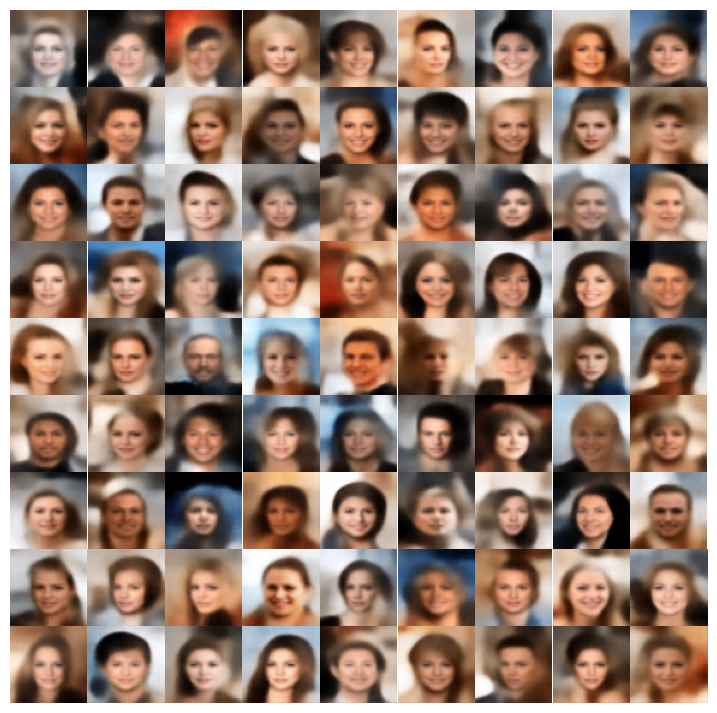
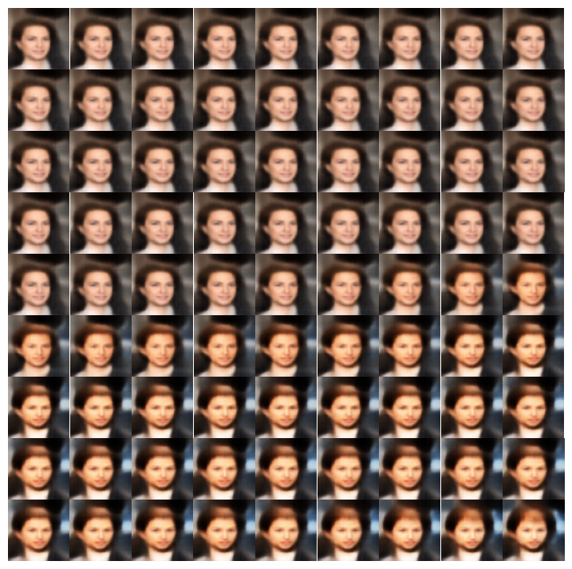
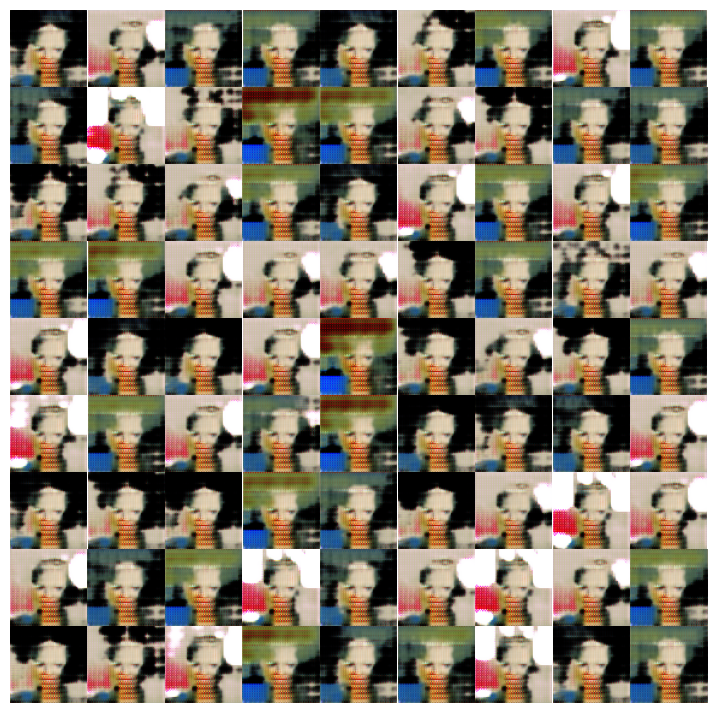
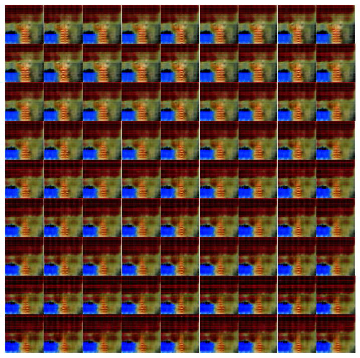

<h1 align='center'>VAE & GAN with PyTorch</h1>
<div align='center'>
	
	
	
</div>
<br/><br/>

## Index

-   [Installation](#installation)
-   [Usage](#usage)
-   [Results](#results)
-   [Licence](#licence)
-   [Contact](#contact)

<br/><br/>

## Installation

```bash
$ git clone https://github.com/younganswer/VAE-GAN.git
$ cd VAE-GAN
$ pip install -r requirements.txt
```

<br/><br/>

## Usage

Check out the `notebook` directory.

<br/><br/>

## Results

|     |                           Generated images                           |                        One sample with variations                         |
| :-: | :------------------------------------------------------------------: | :-----------------------------------------------------------------------: |
| VAE |  |  |
| GAN |  |  |

<br/><br/>

## Licence

This project is licensed under the MIT License - see the [LICENSE](./LICENSE) file for details.

<br/><br/>

## Contact

younganswer@kookmin.ac.kr
