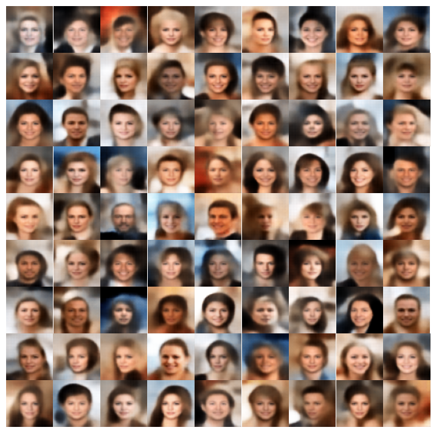
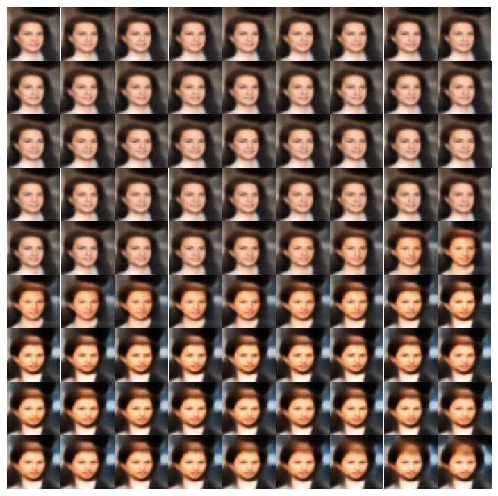
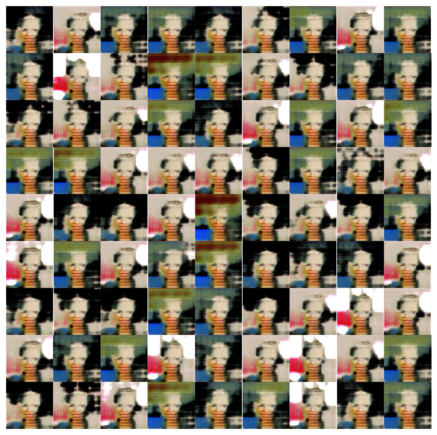
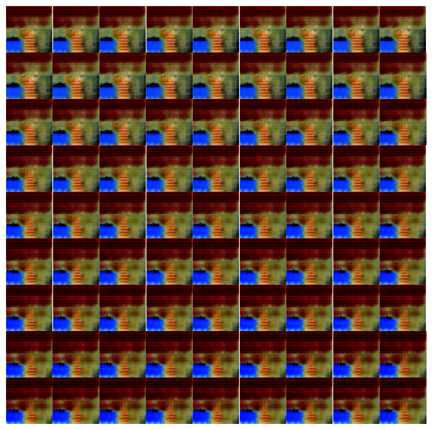

## Index

-   [Abstract](#abstract)
-   [Introduction](#introduction)
-   [Dataset](#dataset)
-   [VAE](#vae)
    -   [Introduction](#introduction-vae)
    -   [Used hyperparameters](#used-hyperparameters-vae)
    -   [Model architecture](#model-architecture-vae)
-   [GAN](#gan)
    -   [Introduction](#introduction-gan)
    -   [Used hyperparameters](#used-hyperparameters-gan)
    -   [Model architecture](#model-architecture-gan)
-   [Results](#results)
-   [Contact](#contact)

<br/><br/>

## Abstract

This project is a PyTorch implementation of `Variational AutoEncoder` (VAE) and `Generative Adversarial Network` (GAN)<br/>
We train the model with a `CustomDataset` and analyze the differences and see the results.

<br/><br/>

## Introduction

VAE and GAN are both Generative models.<br/>
But they have different approaches to generate new data.<br/>
However, the difference is that GAN is generally `harder to learn` than VAE because of the properties below.<br/>

1.  GAN is a zero-sum game with `adversarial` process. Especially, if the discriminator is too strong, the generator can't learn anything.
2.  Hard to find `Nash equilibrium`. The Nash equilibrium is the point where the discriminator can't distinguish the real data and the fake data. But it is hard to find the point because the discriminator and the generator are trained alternately.

To solve the problems above

1. `Pretrain` GAN with VAE and give noise to the discriminator.
2. Use `Least Squares error` (LSGAN) loss function instead of Binary Cross Entropy (BCE) loss function.
3. Use label `flipping` and label `noise`.
4. Use `unbalanced` layer.
5. Use `huge epoch`.

<br/><br/>

## Dataset

The model is trained on the [CelebA dataset](http://mmlab.ie.cuhk.edu.hk/projects/CelebA.html). with using `CustomDataset` class.<br/>
The dataset contains 202,599 face images of various celebrities.<br/>
The images are cropped and resized to 64 square images.<br/>

<br/>

There is a `CustomDataset` class to load your own dataset.<br/>
You can set your own dataset by setting the `root` variable.<br/>
You can split your own dataset into train and test by running `setup.py`.<br/>
Structure of the dataset after setup is as follows.<br/>

<br/>

```
├── dataset
│   ├── CelebA
│   │   ├── train
│   │   │   ├── 000001.jpg
│   │   │   ├── 000002.jpg
│   │   │   ├── ...
│   │   ├── test
│   │   │   ├── 000001.jpg
│   │   │   ├── 000002.jpg
│   │   │   ├── ...
│   │
│   ├── Your dataset
│   │   ├── train
│   │   │   ├── 000001.jpg
│   │   │   ├── 000002.jpg
│   │   │   ├── ...
│   │   ├── test
│   │   │   ├── 000001.jpg
│   │   │   ├── 000002.jpg
│   │   │   ├── ...
```

<br/><br/><br/><br/><br/><br/><br/><br/><br/><br/>

## VAE

### Introduction VAE

This is a PyTorch implementation of Variational AutoEncoder (VAE) based on the paper [Auto-Encoding Variational Bayes](https://arxiv.org/abs/1312.6114).

<br/><br/>

### Used hyperparameters VAE

-   Batch size: 128
-   Learning rate: 0.005
-   Optimizer: Adam
-   Number of epochs: 5
-   KL divergence weight: 0.00025
-   Latent space dimension: 128
-   Loss function: Mean Squared Error (MSE)
-   Activation function: Leaky ReLU
-   Image size: 64 square

<br/><br/><br/><br/><br/><br/><br/><br/><br/><br/><br/><br/><br/><br/><br/><br/><br/><br/><br/><br/><br/><br/><br/><br/><br/>

### Model architecture VAE

-   Unit test with torchsummary

```
----------------------------------------------------------------
        Layer (type)               Output Shape         Param #
================================================================
            Conv2d-1           [-1, 32, 32, 32]             896
       BatchNorm2d-2           [-1, 32, 32, 32]              64
         LeakyReLU-3           [-1, 32, 32, 32]               0
            Conv2d-4           [-1, 64, 16, 16]          18,496
       BatchNorm2d-5           [-1, 64, 16, 16]             128
         LeakyReLU-6           [-1, 64, 16, 16]               0
            Conv2d-7            [-1, 128, 8, 8]          73,856
       BatchNorm2d-8            [-1, 128, 8, 8]             256
         LeakyReLU-9            [-1, 128, 8, 8]               0
           Conv2d-10            [-1, 256, 4, 4]         295,168
      BatchNorm2d-11            [-1, 256, 4, 4]             512
        LeakyReLU-12            [-1, 256, 4, 4]               0
           Conv2d-13            [-1, 512, 2, 2]       1,180,160
      BatchNorm2d-14            [-1, 512, 2, 2]           1,024
        LeakyReLU-15            [-1, 512, 2, 2]               0
           Linear-16                  [-1, 128]         262,272
           Linear-17                  [-1, 128]         262,272
           Linear-18                 [-1, 2048]         264,192
  ConvTranspose2d-19            [-1, 256, 4, 4]       1,179,904
      BatchNorm2d-20            [-1, 256, 4, 4]             512
        LeakyReLU-21            [-1, 256, 4, 4]               0
  ConvTranspose2d-22            [-1, 128, 8, 8]         295,040
      BatchNorm2d-23            [-1, 128, 8, 8]             256
        LeakyReLU-24            [-1, 128, 8, 8]               0
  ConvTranspose2d-25           [-1, 64, 16, 16]          73,792
      BatchNorm2d-26           [-1, 64, 16, 16]             128
        LeakyReLU-27           [-1, 64, 16, 16]               0
  ConvTranspose2d-28           [-1, 32, 32, 32]          18,464
      BatchNorm2d-29           [-1, 32, 32, 32]              64
        LeakyReLU-30           [-1, 32, 32, 32]               0
  ConvTranspose2d-31            [-1, 3, 64, 64]             867
      BatchNorm2d-32            [-1, 3, 64, 64]               6
             Tanh-33            [-1, 3, 64, 64]               0
================================================================
Total params: 3,928,329
Trainable params: 3,928,329
Non-trainable params: 0
----------------------------------------------------------------
Input size (MB): 0.05
Forward/backward pass size (MB): 3.16
Params size (MB): 14.99
Estimated Total Size (MB): 18.19
----------------------------------------------------------------
```

## GAN

### Introduction GAN

This is a PyTorch implementation of Generative Adversarial Network (GAN) based on the paper [Generative Adversarial Networks](https://arxiv.org/abs/1406.2661).<br/>
It is Deep Convolutional GAN (DCGAN) with Least Squares error (LSGAN) loss function based on the paper [Least Squares Generative Adversarial Networks](https://arxiv.org/abs/1611.04076).<br/>
It has unbanlanced layer and is pre-trained with VAE based on the paper [Unbalanced GANs](https://arxiv.org/abs/2002.02112).

<br/><br/>

### Used hyperparameters GAN

-   Batch size: 128
-   Learning rate: 0.005
-   Optimizer: Adam
-   Number of epochs: 5
-   KL divergence weight in pre-training: 0.00025
-   Latent space dimension: 128
-   Loss function: Mean Squared Error (MSE)
-   Activation function: Leaky ReLU
-   Image size: 64 square
-   Label flipping step: 16
-   Label noise with Gaussian distribution: 0.1

<br/><br/>

### Model architecture GAN

-   Unit test with torchsummary

-   Generator

```
----------------------------------------------------------------
        Layer (type)               Output Shape         Param #
================================================================
            Linear-1                 [-1, 2048]         264,192
   ConvTranspose2d-2            [-1, 256, 4, 4]       1,179,904
       BatchNorm2d-3            [-1, 256, 4, 4]             512
         LeakyReLU-4            [-1, 256, 4, 4]               0
   ConvTranspose2d-5            [-1, 128, 8, 8]         295,040
       BatchNorm2d-6            [-1, 128, 8, 8]             256
         LeakyReLU-7            [-1, 128, 8, 8]               0
   ConvTranspose2d-8           [-1, 64, 16, 16]          73,792
       BatchNorm2d-9           [-1, 64, 16, 16]             128
        LeakyReLU-10           [-1, 64, 16, 16]               0
  ConvTranspose2d-11           [-1, 32, 32, 32]          18,464
      BatchNorm2d-12           [-1, 32, 32, 32]              64
        LeakyReLU-13           [-1, 32, 32, 32]               0
  ConvTranspose2d-14           [-1, 32, 64, 64]           9,248
      BatchNorm2d-15           [-1, 32, 64, 64]              64
        LeakyReLU-16           [-1, 32, 64, 64]               0
           Conv2d-17            [-1, 3, 64, 64]             867
             Tanh-18            [-1, 3, 64, 64]               0
================================================================
Total params: 1,842,531
Trainable params: 1,842,531
Non-trainable params: 0
----------------------------------------------------------------
Input size (MB): 0.00
Forward/backward pass size (MB): 4.61
Params size (MB): 7.03
Estimated Total Size (MB): 11.64
----------------------------------------------------------------
```

<br/>

-   Discriminator

```
----------------------------------------------------------------
        Layer (type)               Output Shape         Param #
================================================================
            Conv2d-1           [-1, 32, 32, 32]             896
       BatchNorm2d-2           [-1, 32, 32, 32]              64
         LeakyReLU-3           [-1, 32, 32, 32]               0
            Conv2d-4           [-1, 64, 16, 16]          18,496
       BatchNorm2d-5           [-1, 64, 16, 16]             128
         LeakyReLU-6           [-1, 64, 16, 16]               0
            Conv2d-7            [-1, 128, 8, 8]          73,856
       BatchNorm2d-8            [-1, 128, 8, 8]             256
         LeakyReLU-9            [-1, 128, 8, 8]               0
           Conv2d-10            [-1, 256, 4, 4]         295,168
      BatchNorm2d-11            [-1, 256, 4, 4]             512
        LeakyReLU-12            [-1, 256, 4, 4]               0
           Linear-13                  [-1, 128]         524,416
        LeakyReLU-14                  [-1, 128]               0
           Linear-15                    [-1, 1]             129
================================================================
Total params: 913,921
Trainable params: 913,921
Non-trainable params: 0
----------------------------------------------------------------
Input size (MB): 0.05
Forward/backward pass size (MB): 1.41
Params size (MB): 3.49
Estimated Total Size (MB): 4.94
----------------------------------------------------------------
```

## Results

|     |                           Generated images                           |                        One sample with variations                         |
| :-: | :------------------------------------------------------------------: | :-----------------------------------------------------------------------: |
| VAE |  |  |
| GAN |  |  |

<br/><br/>

## Contact

https://github.com/younganswer/VAE-GAN <br/>
younganswer@kookmin.ac.kr
